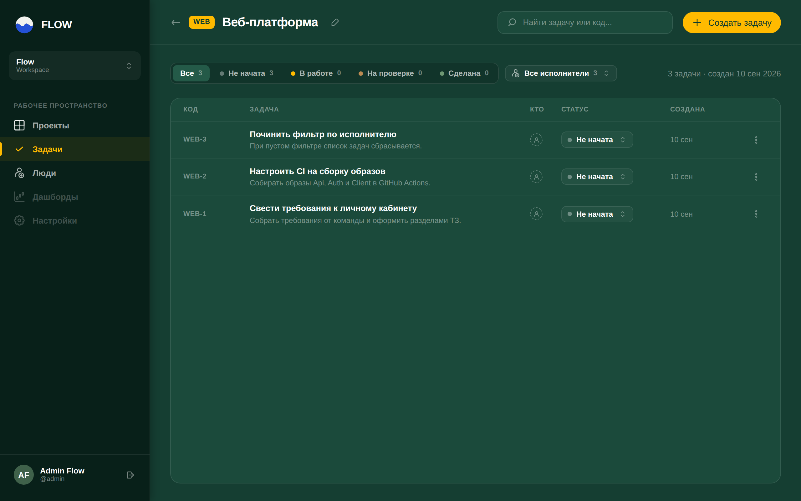
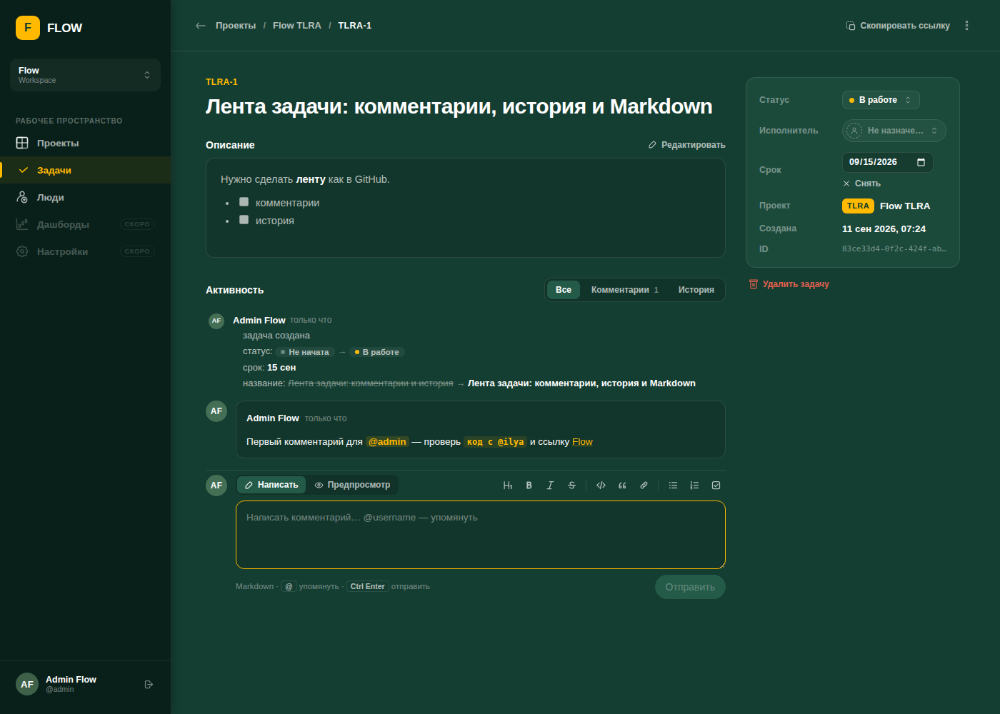
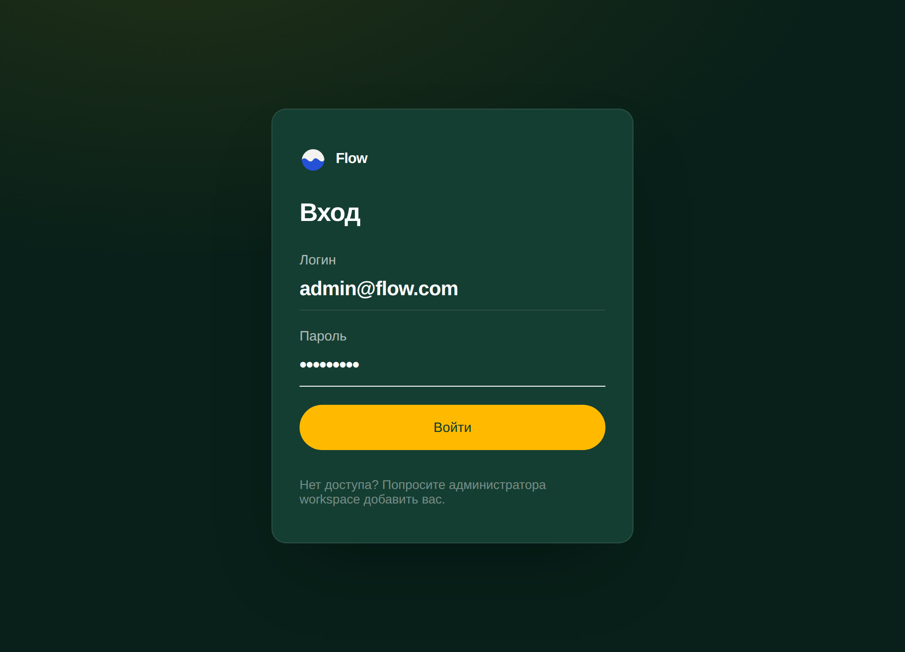
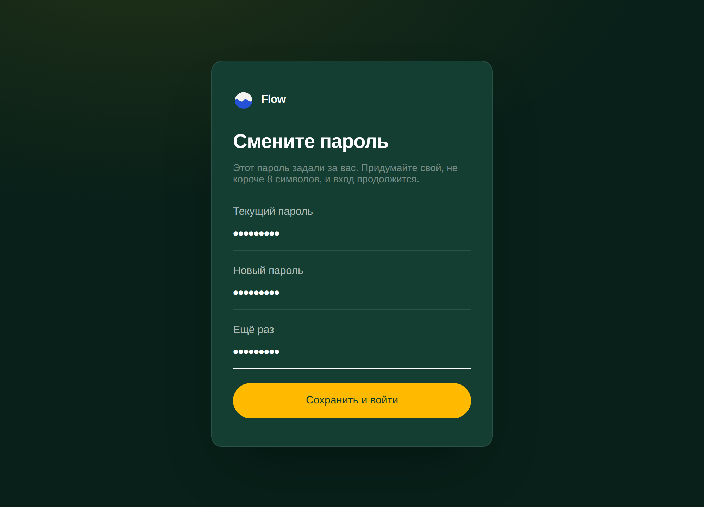
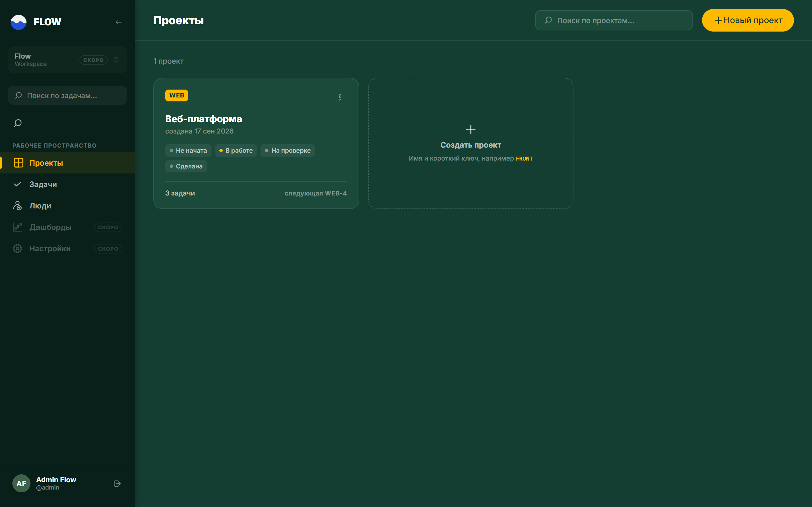
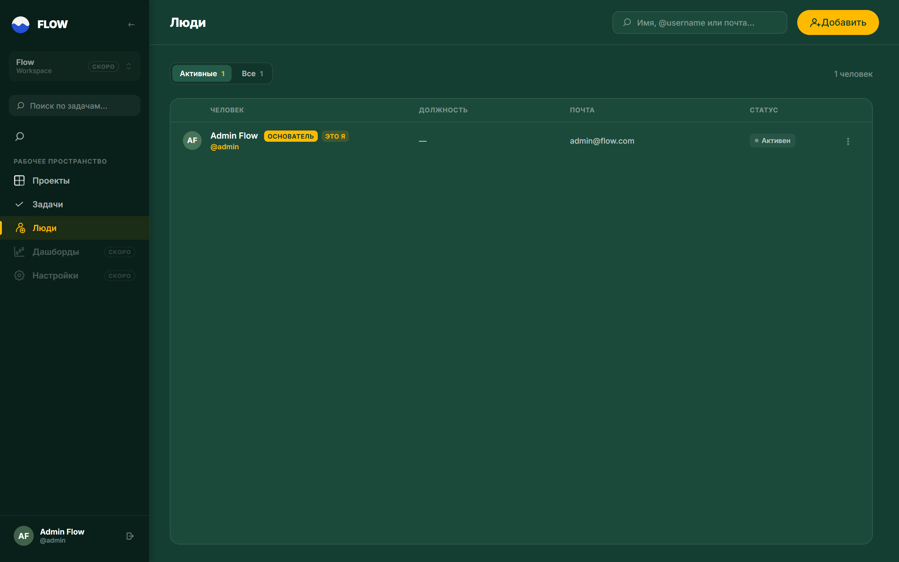

# Flow

English · [Русский](README.ru.md)

A project task tracker built on .NET 10: a server API, a standalone authentication service, and a Blazor WebAssembly client. The whole stack starts with a single Docker command.

## What it is for

Flow tracks a team's work: projects (boards) with their own status sets, tasks with human-readable codes (`FLOW-12`), assignees, roles and access rules. Everything runs on your own infrastructure — no external services required.

The longer-term goal is an AI assistant inside the tracker: grounded in the team's knowledge base, it drafts specifications in the project's own format, decomposes them into board tasks, and builds business-process diagrams. Inference is planned to run locally so project data never leaves the team's infrastructure. Design work happens in [#1](https://github.com/azizmac/Flow/issues/1) and [#5](https://github.com/azizmac/Flow/issues/5); no AI subsystem exists in the code yet.

## What works today

- **Projects and tasks.** A board with a key (`^[A-Z][A-Z0-9]{1,9}$`), four default statuses, tasks coded `KEY-N`, assignment, filtering by assignee.
- **Users.** Profiles (name, contacts, external links), `Invited / Active / Deactivated` states, search and autocomplete.
- **Roles and permissions.** `Reader → Member → Developer → Admin → Owner`; the permission matrix is enforced on the server, and the client hides actions the current user cannot perform. A "last Owner" rule prevents locking the instance out of administration.
- **Task timeline.** Markdown comments with `@mentions` (a GitHub-style editor with preview and toolbar) and a change log: title, description, status, assignee, due date, deleted comments. Due dates with overdue highlighting.
- **Authentication.** A separate `Flow.Auth` service: ASP.NET Core Identity with BCrypt and OpenIddict (authorization code + PKCE, refresh, client credentials). The client signs in over OIDC; the API acts as a resource server validating Bearer JWTs. The initial password must be changed at first sign-in.
- **Infrastructure.** PostgreSQL 16, EF Core, migrations applied on API startup. Build, tests and image publishing run in GitHub Actions.





## Roadmap

Done:

- [x] Boards, statuses, tasks, task codes
- [x] User profiles and external links
- [x] Roles, user states, permission matrix
- [x] Authentication extracted into an OpenIddict service, OIDC sign-in from the client
- [x] Mandatory initial password change
- [x] Whole stack in Docker with one command, CI building and publishing images
- [x] Comments, change log and Markdown editor on a task, due dates

Next — the `Flow.AI` subsystem ([#5](https://github.com/azizmac/Flow/issues/5), [#1](https://github.com/azizmac/Flow/issues/1)):

- [ ] **Phase A. Context storage design** — schema for memory, skills, sessions, knowledge base and artifacts; memory budgeting and consolidation; session history compression; pgvector on the existing PostgreSQL
- [ ] **Phase B. Integration spike** — pick an LLM and embedding provider, build a vertical slice of `POST /ai/chat` with memory and history, prototype skill trigger matching
- [ ] **Phase C. Specifications and diagrams** — a draft → decompose → critique → apply loop with versioned artifacts and task creation on a board; generating and reading draw.io diagrams, rendering them in the client

Every write performed by the AI goes through human confirmation: draft, confirm, then persist.

## Running it

Docker with the Compose plugin is the only prerequisite.

```bash
git clone https://github.com/azizmac/Flow.git
cd Flow
cp .env.example .env
docker compose up -d --build
```

The first build takes a few minutes. Once the containers are up, the client is at http://localhost:5016 — continue with "First sign-in" below.

Services: client :5016, API :8080, authentication :5100, PostgreSQL :5432, S3-compatible storage :9000 with its console on :9001. Ports and the bootstrap user's credentials come from `.env`, which is not tracked in git. If a local PostgreSQL already holds port 5432, set `POSTGRES_PORT=5433`.

Token-signing certificates are generated on first start, and the `flow` and `flow_auth` databases are created by migrations. Stop the stack with `docker compose down`, or `docker compose down -v` to drop its data as well.

## First sign-in

The first start creates a bootstrap user — the single account every other account is created from:

| | |
|---|---|
| Login | `admin` (the email `admin@flow.com` works too) |
| Password | `admin` — must be changed at first sign-in |
| Role | Owner: full rights over projects, people and roles |

The values come from `.env` (`BOOTSTRAP_USERNAME`, `BOOTSTRAP_EMAIL`, `BOOTSTRAP_PASSWORD`) and are applied once, when the database is created. Changing them after the first run has no effect — change the password through the UI instead.

**1. Open http://localhost:5016.** The client checks for a session and, finding none, sends you to the Flow.Auth sign-in page on :5100. The login field accepts either a username or an email.



**2. Set your own password.** The initial password is flagged as temporary, so a password-change form opens instead of the app: the current password is `admin`, the new one must be at least 8 characters. Authentication does not complete until it is changed.



**3. You are in.** After saving, the browser returns to the client with a session, on the Projects page. From there, "Новый проект" asks for a name and a key (say `WEB`), and tasks get codes `WEB-1`, `WEB-2` and so on.



**4. Check yourself under "Люди" (People).** The bootstrap user shows up as "Основатель" (Owner) with an active status; the "Добавить" button creates everyone else — they also get a temporary password to change at their first sign-in.



Sign out with the icon next to your name at the bottom of the sidebar. A forgotten password is reset by an Owner from that person's profile; if the Owner account itself is lost, `docker compose down -v` wipes the data and the bootstrap user is created again.

The interface is in Russian.

## Documentation

Project documentation is written in Russian.

- [`AGENTS.md`](AGENTS.md) — architecture, invariants, conventions, commands
- [`docs/TZ_board_task_status.md`](docs/TZ_board_task_status.md) — boards, statuses, tasks
- [`docs/TZ_user.md`](docs/TZ_user.md) — users and profiles
- [`docs/TZ_user_roles.md`](docs/TZ_user_roles.md) — roles, states, permission matrix
- [`docs/TZ_auth.md`](docs/TZ_auth.md) — authentication and Flow.Auth
- [`docs/TZ_task_activity_comments.md`](docs/TZ_task_activity_comments.md) — comments, change log, Markdown editor, due dates
- [`docs/Struktura_board_task_status.md`](docs/Struktura_board_task_status.md) — domain model structure
- [`docs/Sravnenie_DbContext_podhodov.md`](docs/Sravnenie_DbContext_podhodov.md) — DbContext approaches compared

## License

The source is open: anyone may use, study, modify and self-host Flow for their own purposes, free of charge. Selling Flow — as a product, a subscription, or a hosted service — is reserved to the copyright holders. A formal license text will be added separately.
